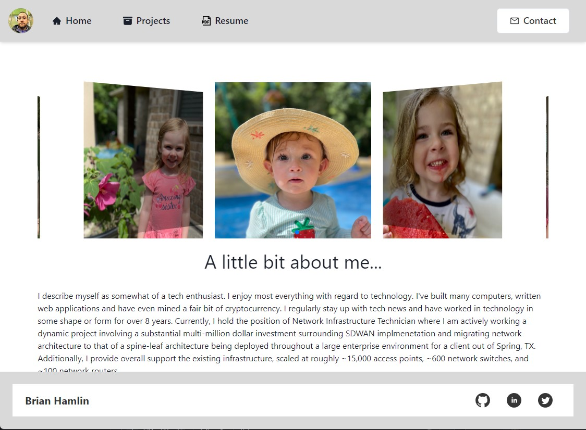
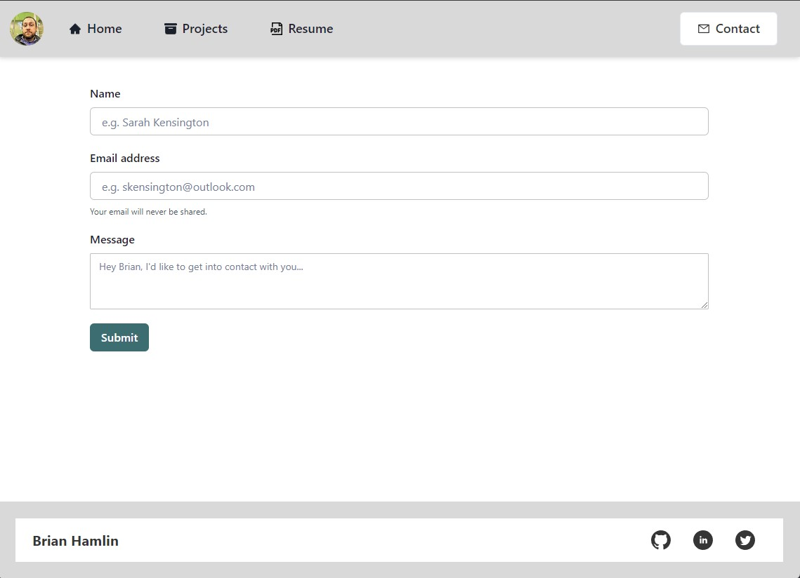
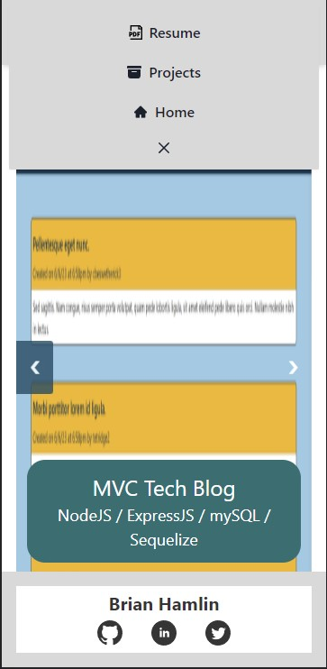

# Portfolio

## Table of Contents 
* [Description](#Description) 

* [Usage](#Usage) 

* [License](#License) 

* [Questions](#Questions) 

* [Screenshots](#Screenshots) 

### Description
Presenting various applications built as a collection, for the purposes of showcasing my work.  
Made with <a href="https://create-react-app.dev/">create-react-app</a>, styled with <a href="https://chakra-ui.com/">Chakra UI</a>, with some animation and functionality incorporated from <a href="https://animate.style/">Animate.css</a> and <a href="https://www.emailjs.com/">EmailJS</a>, respectively . Site is fully mobile responsive. 

### Usage
Link to live application: {Place Link Here}

### License
Further information regarding this specific license can be found via: https://opensource.org/license/mit/.  

### Questions
Should you have any further questions, please reach the developer at: misterbham.dev@gmail.com.   
GitHub: <a href="https://github.com/MisterBham">MisterBham</a>   

### Screenshots
   
   
   
